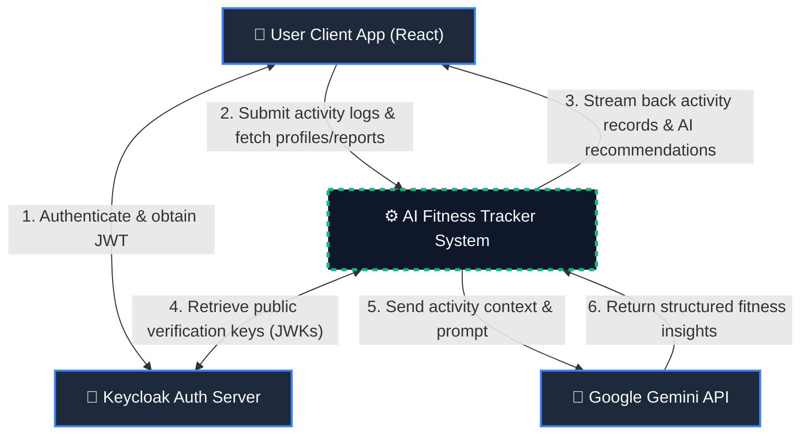
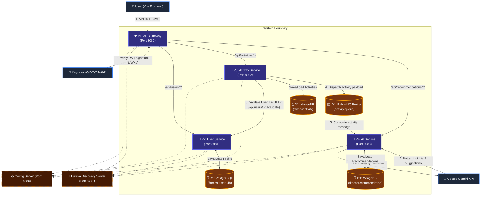
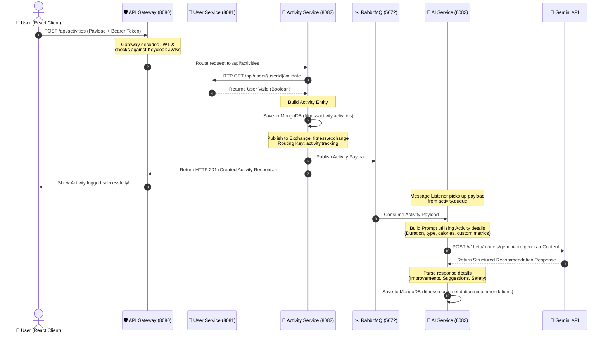

# 🏋️‍♂️ AI-Powered Fitness Tracker Microservices

A modern, cloud-native, event-driven microservices application designed to track fitness activities and generate personalized, AI-driven wellness recommendations using Google's Gemini API.

---

## 🏗️ Architecture Overview

The system is built on **Spring Cloud** and **React** with a decoupled, asynchronous, event-driven communication pipeline using **RabbitMQ**.

### Key Features
*   🔐 **OAuth2 & JWT Security**: Centralized user authentication and authorization using **Keycloak**.
*   🌐 **Service Discovery & Routing**: Dynamic registration with **Netflix Eureka** and unified API routing via **Spring Cloud Gateway**.
*   ⚙️ **Centralized Configuration**: Service parameters managed externally by **Spring Cloud Config Server**.
*   ⚡ **Event-Driven AI Integration**: Activities logged by users publish event messages to **RabbitMQ**, which triggers the **AI Recommendation Service** to dynamically generate personalized insights via **Google Gemini API** asynchronously.
*   🗄️ **Polyglot Persistence**: 
    *   **PostgreSQL** for structured user profile data.
    *   **MongoDB** for highly flexible, document-based fitness activities and AI recommendations.

---

## 📊 Data Flow Diagrams (DFDs)

These diagrams describe how data enters, flows through, and is transformed by the AI Fitness Tracker ecosystem.

### Level 0: System Context Diagram
The Context Diagram defines the system boundaries, showing external entities (User, Keycloak, Gemini API) and their core interactions with the system as a single black box.



---

### Level 1: Microservices DFD (Data Flow & Process View)
This diagram decomposes the system into its core functional processes (microservices), data stores, and details the exact routing and data paths between them.



---

### Level 2: Activity Log & AI Recommendation Pipeline
This detailed view trace the specific transformations, validation checks, and asynchronous communications that occur when a user logs a physical activity.



---

## 🛠️ Technology Stack

| Service Component | Technology / Framework | Port | Database / Storage | Key Dependencies |
| :--- | :--- | :--- | :--- | :--- |
| **Config Server** | Spring Boot 3.x, Spring Cloud Config | `8888` | Local Directory (`classpath:/config`) | Config Server |
| **Eureka Server** | Spring Boot 3.x, Spring Cloud Netflix Eureka | `8761` | Memory (In-Memory registry) | Eureka Server |
| **API Gateway** | Spring Boot 3.x, Spring Cloud Gateway | `8080` | N/A | Spring Security OAuth2, Webflux |
| **User Service** | Spring Boot 3.x | `8081` | **PostgreSQL** (`fitness_user_db`) | Spring Data JPA, Hibernate, PostgreSQL Driver |
| **Activity Service** | Spring Boot 3.x | `8082` | **MongoDB** (`fitnessactivity`) | Spring Data MongoDB, RabbitMQ Starter, Webflux (WebClient) |
| **AI Service** | Spring Boot 3.x | `8083` | **MongoDB** (`fitnessrecommendation`) | Spring Data MongoDB, RabbitMQ Starter, Google Gemini Client |
| **Web Frontend** | React, Vite | `5173` | Local Storage / Session Storage | Axios, OAuth2 PKCE Client |
| **Identity Provider**| Keycloak | `8181` | Keycloak Database (default H2/Postgres) | OpenID Connect / OAuth2 |
| **Message Broker** | RabbitMQ | `5672` (AMQP)<br>`15672` (UI) | RabbitMQ Queue Store | AMQP 0-9-1 Protocol |

---

## 🚀 Local Run & Startup Sequence

To start the system locally, spin up the supporting infrastructure and services in the following order.

### Phase 1: Infrastructure (Databases & Dockerized Components)
Make sure your backing services are up and running:
1.  **PostgreSQL**: Start your local instance. Create database `fitness_user_db`.
2.  **MongoDB**: Start your local instance (port `27017`).
3.  **RabbitMQ (Hosted in Docker)**: Start the RabbitMQ container (with Management console) on ports `5672` (AMQP) and `15672` (UI dashboard):
    ```bash
    docker run -d --name rabbitmq -p 5672:5672 -p 15672:15672 rabbitmq:4-management
    ```
4.  **Keycloak (Hosted in Docker)**: Run the Keycloak container on port `8181` mapped to the default keycloak port `8080`:
    ```bash
    docker run -d --name keycloak -p 8181:8080 -e KEYCLOAK_ADMIN=admin -e KEYCLOAK_ADMIN_PASSWORD=admin quay.io/keycloak/keycloak:22.0.1 start-dev
    ```
    *Note: Once running, access the Keycloak admin panel at `http://localhost:8181`, log in, import/configure the realm `fitness-oauth2`, and add the client `oauth2-pkce-client`.*

### Phase 2: Core Spring Boot Services
Start the Java backend projects in this exact order:
1.  **Config Server (`configserver`)**:
    *   *Directory*: `configserver/`
    *   *Command*: `./mvnw spring-boot:run`
2.  **Eureka Server (`eureka`)**:
    *   *Directory*: `eureka/`
    *   *Command*: `./mvnw spring-boot:run`
3.  **API Gateway (`gateway`)**:
    *   *Directory*: `gateway/`
    *   *Command*: `./mvnw spring-boot:run`
4.  **User Service (`userservice`)**:
    *   *Directory*: `userservice/`
    *   *Command*: `./mvnw spring-boot:run`
5.  **Activity Service (`activityservice`)**:
    *   *Directory*: `activityservice/`
    *   *Command*: `./mvnw spring-boot:run`
6.  **AI Service (`aiservice`)**:
    *   *Directory*: `aiservice/`
    *   *Command*: `./mvnw spring-boot:run`
    *   *Environment Variables*: Ensure you have set:
        ```bash
        GEMINI_API_URL=https://generativelanguage.googleapis.com/v1beta/models/gemini-1.5-flash:generateContent
        GEMINI_API_KEY=your_actual_gemini_api_key
        ```

### Phase 3: Frontend Web Application
1.  Navigate to the frontend directory:
    ```bash
    cd fitness-app-frontend
    ```
2.  Install dependencies:
    ```bash
    npm install
    ```
3.  Start the Vite developer server:
    ```bash
    npm run dev
    ```
4.  Access the web application at `http://localhost:5173`.
